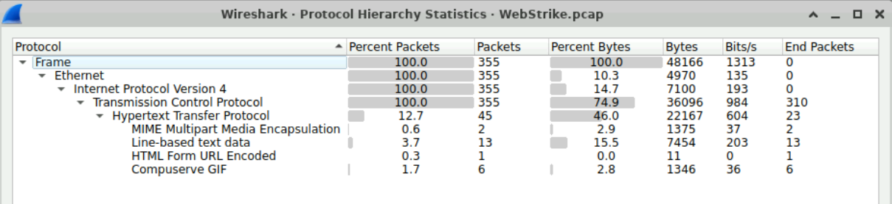
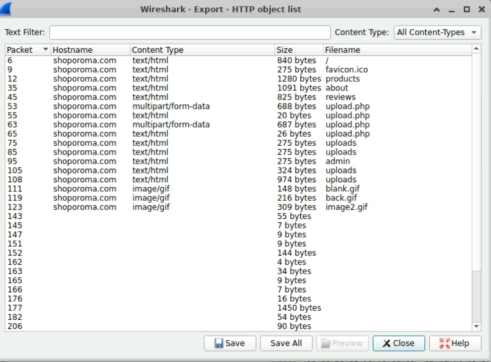
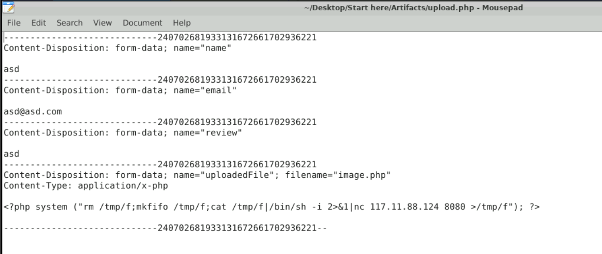
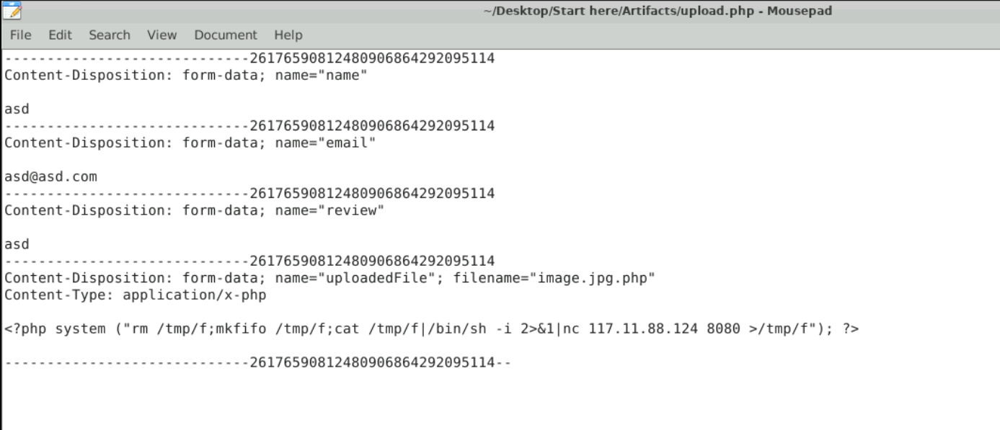
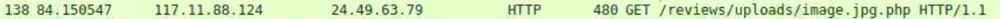
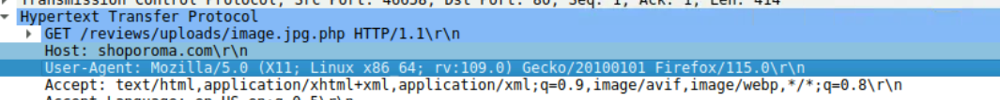
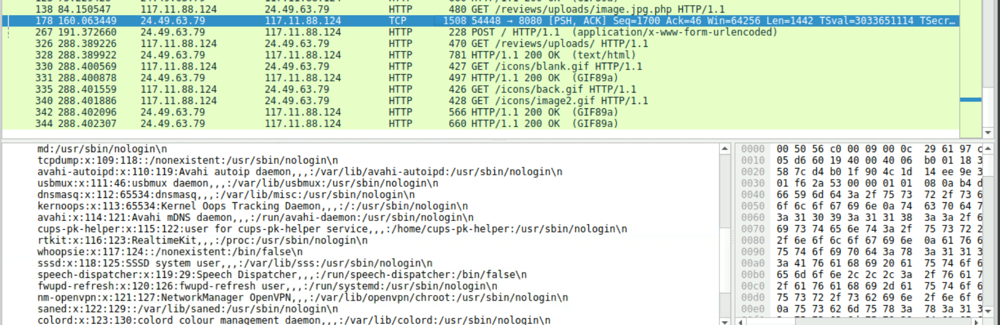

# Webstrike Lab — SOC Write-up (CyberDefender)

Overview
- Objective: Analyze the provided PCAP to identify the attack source, web shell upload technique, upload directory, outbound port used, and file targeted for exfiltration.
- Analysis file: `/D:/H4ck DOC/xinloihuy.github.io/posts/webstrike-lab.md`
- PCAP provided by the network team after a suspicious file was found on the web server.

Quick process
1. Inspect protocol statistics to find abnormal HTTP traffic.
    
2. Export HTTP objects to locate suspicious PHP files.
    

Initial findings
- Two uploaded PHP files recovered from traffic:
  - `upload.php` (first version, direct upload failed)
     
  - `upload.php` (second version, shows double-extension technique)
     
- The file that succeeded in uploading: `image.jpg.php`
  

Detailed analysis & answers (Q1–Q6)

Q1 — Geographic source of the attack  
- Attacking IP: `117.11.88.124` (from packet capture).  
- Geolocation lookup (e.g., iplocation.net) shows: Country: China, City: Tianjin.  
- Conclusion: Tianjin, China.

Q2 — Full User‑Agent of the attacker  
- User‑Agent from the HTTP request:  
  Mozilla/5.0 (X11; Linux x86_64; rv:109.0) Gecko/20100101 Firefox/115.0  
  

Q3 — Name of the web shell uploaded successfully  
- Web shell file: `image.jpg.php` (double extension used to bypass checks).  
  

Q4 — Directory where uploads are stored on the website  
- Destination directory: `/reviews/uploads/` (from HTTP request/path).  
  (Confirmed in capture/HTTP request)

Q5 — Port on the attacker machine the web shell used for outbound connection  
- Port attempted by the web shell to connect/listen: `8080`.  
  

Q6 — File attempted to be exfiltrated  
- Targeted file: `/etc/passwd` (seen in session payload).  
  

Summary (quick results)
- Source city: Tianjin, China  
- User‑Agent: Mozilla/5.0 (X11; Linux x86_64; rv:109.0) Gecko/20100101 Firefox/115.0  
- Web shell: image.jpg.php  
- Upload directory: /reviews/uploads/  
- Port targeted: 8080  
- File targeted for exfiltration: /etc/passwd

Short recommendations for SOC
- Block/monitor traffic from `117.11.88.124` and related IPs.  
- Remove the web shell from `/reviews/uploads/` and review other uploads.  
- Enforce upload checks: validate MIME type and disallow double extensions.  
- Audit web server and system logs for similar requests or shell commands.

Files/references in this write-up
- Extracted images and packet screenshots: `../assets/webstrike-lab/0.png` … `../assets/webstrike-lab/8.png`

Complete — lab answered all 6 questions.
